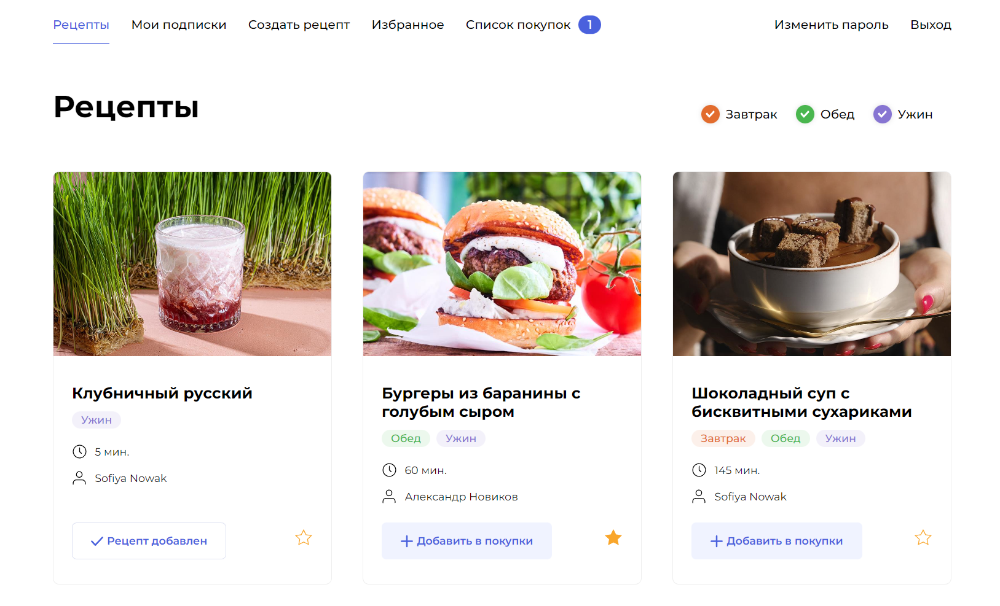

# Foodgram — сайт рецептов ![Workflow-badge]

*Проект Foodgram «Продуктовый помощник».* Онлайн-сервис, в котором пользователи могут 
публиковать рецепты.



### 🔥 Возможности

- Создавать свои рецепты
- Подписываться на авторов
- Добавлять чужие рецепты в избранное
- Добавлять чужие рецепты в корзину
- Скачивать список продуктов для блюд

### 👨‍💻 Технологии

[![Python][Python-badge]][Python-url]
[![DRF][DRF-badge]][DRF-url]
[![Gunicorn][Gunicorn-badge]][Gunicorn-url]
[![Postgres][Postgres-badge]][Postgres-url]
[![Docker][Docker-badge]][Docker-url]
[![Nginx][Nginx-badge]][Nginx-url]
[![Yandex-Cloud][Yandex-Cloud-badge]][Yandex-Cloud-url]
[![Github-Actions][Github-Actions-badge]][Github-Actions-url]

## ⚙ Начало Работы

Чтобы запустить копию проекта, следуйте инструкциям ниже.

### ⚠ Зависимости

- [Python 3.7+][Python-url]
- [Docker][Docker-url]


### 🏭 Запуск на сервере

1. **Обновите пакеты**
   
   ```bash
   sudo apt-get update
   sudo apt-get upgrade
   ```

2. **Установите docker compose**
   
   ```bash
   sudo apt-get install docker.io
   sudo apt-get install docker-compose
   ```

3. **Перенести необходимые файлы**
   
   ```bash
   scp docker-compose.yml <username>@<host>:/home/<username>/
   scp nginx.conf <username>@<host>:/home/<username>/
   scp -r docs/ <username>@<host>:/home/<username>/docs/
   ```

4. **Создайте *dotenv-файл***

   ```bash
   touch .env
   ```

   ```dotenv
   EMAIL_BACKEND=django.core.mail.backends.smtp.EmailBackend
   EMAIL_HOST=your.email.host
   EMAIL_PORT=555
   EMAIL=your@email.com
   EMAIL_PASSWORD=your-sending-email-password
   DJANGO_SECRET_KEY=your-django-secret
   DB_ENGINE=django.db.backends.postgresql
   DB_NAME=postgres
   POSTGRES_USER=postgres
   POSTGRES_PASSWORD=password_here
   DB_HOST=host_here
   DB_PORT=5432
   DEBUG=True
   ALLOWED_HOSTS=localhost;127.0.0.1;backend;yourhost
   ```
   
   ###### **Секретный ключ можно сгенерировать [тут](https://djecrety.ir/)*

5. **Добавьте адрес в конфиг nginx**

   ```nginx
   server {
    listen 80;
    server_tokens off;
    server_name yourhost;
   ```

6. **Запустите контейнеры**

   ```bash
   sudo docker-compose up
   ```
   
7. **Завершите настройку Django**
   
   ```bash
   python manage.py migrate --no-input
   python manage.py collectstatic --no-input --clear
   python manage.py import_ingredients_json --no-input
   ```
   
   Запустите команды для выполнения миграций, сбора статики и
   добавления ингредиентов в контейнере


## 👀 Использование


### 📖 API (Docs: [OpenAPI](docs/openapi-schema.yml))

Документация доступна по ссылке: http://localhost/api/docs/redoc.html

   ###### **Локальный эндпоинт*

## 🛠 Development

1. **Установите зависимости проекта**

    ```shell
    pip install -r requirements.txt
    ```

2. **Создайте *dotenv-файл* в корне настроек**

    ```dotenv
    EMAIL=your@email.com
    DJANGO_SECRET_KEY=django-insecure-c!1%u=@5f*u-*?9@jrst=k%-mziamu!voagve&lf=k7kqhn8qf
    DB_ENGINE=django.db.backends.postgresql
    DB_NAME=postgres
    POSTGRES_USER=postgres
    POSTGRES_PASSWORD=password_here
    DB_HOST=localhost
    DB_PORT=5432
    ```

3. **Запустите dev-сервер**

    ```bash
    python manage.py runserver --settings=foodgram.dev-settings
    ```
   
---

<h5 align="center">
Автор проекта: <a href="https://github.com/HETPAHHEP">HETPAHHEP</a>
</h5>

<!-- MARKDOWN BADGES & URLs -->
[Python-badge]: https://img.shields.io/badge/Python-4db8ff?style=for-the-badge&logo=python&logoColor=%23ffeb3b

[Python-url]: https://www.python.org/

[Gunicorn-badge]: https://img.shields.io/badge/gunicorn-%298729.svg?style=for-the-badge&logo=gunicorn&logoColor=white

[Gunicorn-url]: https://gunicorn.org/

[Postgres-badge]: https://img.shields.io/badge/postgres-%23316192.svg?style=for-the-badge&logo=postgresql&logoColor=white

[Postgres-url]: https://www.postgresql.org/

[Docker-badge]: https://img.shields.io/badge/docker-%230db7ed.svg?style=for-the-badge&logo=docker&logoColor=white

[Docker-url]: https://www.docker.com/

[Nginx-badge]: https://img.shields.io/badge/nginx-%23009639.svg?style=for-the-badge&logo=nginx&logoColor=white

[Nginx-url]: https://nginx.org

[DRF-badge]: https://img.shields.io/badge/Django_REST-f44336?style=for-the-badge&logo=django

[DRF-url]: https://www.django-rest-framework.org

[Yandex-Cloud-badge]: https://img.shields.io/badge/Yandex_Cloud-white?style=for-the-badge

[Yandex-Cloud-url]: https://cloud.yandex.ru

[Github-Actions-badge]: https://img.shields.io/badge/Github_Actions-%239c27b0?style=for-the-badge&logo=github%20actions&logoColor=white

[Github-Actions-url]: https://github.com/features/actions

[Workflow-badge]: https://img.shields.io/github/actions/workflow/status/HETPAHHEP/foodgram-project-react/foodgram-workflow.yml?style=for-the-badge&logo=github&label=Foodgram%20Workflow
